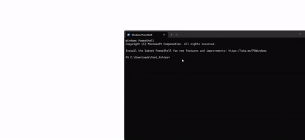
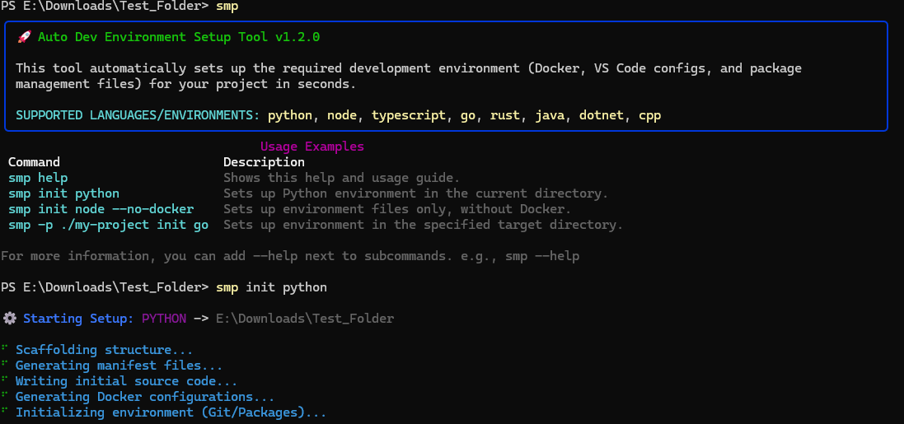

<div align="center">

# 🚀 SMP (Auto Dev Environment Setup Tool)
# Instant Dev Environment Setup CLI (InstantDevSetup)

**Enterprise-Grade Automated Workspace & Development Scaffold Engine**

[](https://www.python.org/)
[](https://click.palletsprojects.com/)
[](https://github.com/Textualize/rich)
[](LICENSE)

---

[English Description](#-english) • [Türkçe Açıklama](#-türkçe) • [Command Reference / Komut Kılavuzu](#-command-reference--komut-kılavuzu) • [Antivirus Notice / Güvenlik Bildirimi](#%EF%B8%8F-antivirus--windows-smartscreen-notice-false-positive)

</div>

---




## 🌍 English

### 🛡️ Antivirus & Windows SmartScreen Notice (False Positive)
> ⚠️ **Important:** When launching the pre-compiled standalone `.exe` file, Windows Defender or your antivirus software might trigger a warning (e.g., SmartScreen). This is a **False Positive** common to standalone executables packaged via PyInstaller. Because this repository is open-source and lacks a costly commercial digital certificate (Code Signing), security engines flag it by default. The application is **100% safe to run**, completely transparent, and free of any hidden tracking or malware.

SMP is an enterprise-grade, ultra-fast Command Line Interface (CLI) engineered to automatically scaffold standard development environments in seconds. It delegates workspace construction to a multi-threaded processing layer—instantly generating secure multi-stage Dockerfiles, highly-optimized VS Code workspace configurations, core dependency manifests, and initial boilerplate files for your projects.

### 🔥 Key Features
* **Multi-Language Core:** Seamless workspace generation for **8+ ecosystems** (Python, Node, TS, Go, Rust, Java, .NET, C++).
* **Zero-Dependency Portability:** Compiled into a single independent binary wrapper. Works out of the box on any Windows machine without requiring a Python runtime.
* **Premium Terminal UX:** Beautifully crafted console layout using the Rich library with smooth animations and multi-language (TR/EN) adaptive localization.

### ⚖️ Disclaimer & Liability Limitation
The software is provided "as is", without warranty of any kind, express or implied. In no event shall the authors or copyright holders be liable for any claim, damages, data loss, environment misconfigurations, or other liability arising from, out of, or in connection with the software or the use or other dealings in the software. By executing this binary, you assume full responsibility for your operating system runtime environment.


---

## 🇹🇷 Türkçe

### 🛡️ Antivirüs ve Windows SmartScreen Uyarısı (Yalancı Pozitif)
> ⚠️ **Önemli Not:** Hazır derlenmiş bağımsız `.exe` dosyasını ilk kez çalıştırdığınızda Windows Defender veya antivirüs programınız bir uyarı ekranı (SmartScreen vb.) çıkartabilir. Bu durum, PyInstaller ile paketlenen taşınabilir uygulamalarda sıkça karşılaşılan bir **Yalancı Pozitif (False Positive)** reaksiyondur. Proje tamamen açık kaynaklıdır ancak yıllık yüksek maliyetleri olan ticari bir dijital sertifikaya (Code Signing) sahip olmadığı için antivirüsler tarafından varsayılan olarak "bilinmeyen yazılım" olarak etiketlenir. Uygulama **%100 güvenlidir**; hiçbir veri takibi veya zararlı yazılım barındırmaz.

SMP; projeniz için gerekli olan kurumsal standartlardaki geliştirme ortamını saniyeler içinde tamamen otomatik olarak kuran, ultra hızlı bir Komut Satırı Arabirimi (CLI) motorudur. Geliştirme alanı inşasını çok iş parçacıklı bir katmana devrederek; güvenli multi-stage Dockerfile'lar, optimize edilmiş VS Code ayarları, bağımlılık yönetim manifestoları ve başlangıç kod yapılarını sıfırdan üretir.

### 🔥 Öne Çıkan Özellikler
* **Geniş Dil Matrisi:** **8'den fazla yazılım ekosistemi** için (Python, Node, TS, Go, Rust, Java, .NET, C++) eksiksiz çalışma alanı kurulumu.
* **Tam Bağımsız Taşınabilir Yapı:** Tek bir bağımsız executable (.exe) dosyasına indirgenmiştir. Hedef bilgisayarda Python yüklü olmasa bile doğrudan çalışır.
* **Premium Konsol Arayüzü:** Rich kütüphanesi ile güçlendirilmiş, akıcı yükleme animasyonlarına ve dinamik yerelleştirme (TR/EN) desteğine sahip kusursuz terminal mimarisi.

### ⚖️ Sorumluluk Reddi Beyanı
Bu yazılım kullanıcıya "olduğu gibi" sunulmaktadır. Yazılımın kullanımından doğrudan veya dolaylı olarak sisteminizde oluşabilecek hiçbir olumsuzluktan, veri kaybından, işletim sistemi konfigürasyon bozukluklarından veya donanımla ilgili sorunlardan geliştiriciler **hiçbir şart altında sorumlu tutulamaz.** Bu `.exe` dosyasını indiren ve koşturan her kullanıcı, oluşabilecek tüm risklerin kendi sorumluluğunda olduğunu peşinen kabul etmiş sayılır.

---

## 💻 Command Reference & Usage / Komut Kılavuzu

You can trigger the engine using `setup-my-project`, `s-m-p`, or the ultra-fast shortcut **`smp`**. / Motoru ateşlemek için `setup-my-project`, `s-m-p` veya en hızlı kısaltma olan **`smp`** komutunu kullanabilirsiniz.

| Target Environment / Hedef Ortam | Standard Scaffolding Command / Standart Kurulum Komutu |
| :--- | :--- |
| **Python Toolchain** | `smp init python` |
| **Node.js Environment** | `smp init node` |
| **TypeScript Architecture** | `smp init typescript` |
| **Go Workspace** | `smp init go` |
| **Rust Cargo System** | `smp init rust` |
| **Java Maven Lifecycle** | `smp init java` |
| **.NET Web API Layout** | `smp init dotnet` |
| **C++ CMake Engine** | `smp init cpp` |

### ⚙️ Advanced Execution Flags / Gelişmiş Çalıştırma Parametreleri

* **Show Application Help Menu / Yardım Menüsünü Göster:**
```powershell
  smp help
Exclude Dockerfiles From Scaffolding / Docker Olmadan Kurulum Yap:

PowerShell
  smp init rust --no-docker
Target a Specific Custom Directory / Özel Bir Klasör Yolunu Hedef Al:

PowerShell
  smp -p E:\Projects\TargetWorkspace init typescript
Enable Full Subprocess Debug Logs / Detaylı Alt Sistem Loglarını Aktif Et:

PowerShell
  smp -v -p ./test-zone init go
```
### 📦 Installation & Compiling - Kurulum & Derleme

🚀 Standalone Executable (Recommended) / Hazır Çalıştırılabilir Dosya (Önerilen)
No Python environment required. Go straight to the Releases section, download the pre-compiled smp.exe, drop it into your target project folder, and run your commands instantly.
(Herhangi bir Python kurulumuna gerek yoktur. Doğrudan Sürümler bölümünden smp.exe dosyasını indirin, boş bir klasöre atın ve terminalinizden komutunuzu çalıştırın.)

### 📋 Prerequisites for Source Running / Kaynak Kod Ön Gereksinimleri
Before running or compiling from source, ensure you have the following installed: / Kaynak koddan çalıştırmadan veya derlemeden önce sisteminizde aşağıdakilerin kurulu olduğundan emin olun:

Python 3.11 (Highly recommended for ecosystem stability / Kararlılık için kesinlikle 3.11 sürümü önerilir)

Git (To clone the repository / Projeyi yerel bilgisayarınıza çekmek için)

### 🛠️ Developer Setup & Compilation / Geliştirici Kurulumu ve Derleme

1. Clone the Repository / Projeyi Klonlayın
Bash
git clone [https://github.com/HexanovaCore/InstantDevSetup.git](https://github.com/HexanovaCore/InstantDevSetup.git)
cd InstantDevSetup
3. Install Package in Editable Mode / Paket Bağlantılarını Kaydedin
PowerShell
pip install -e .
4. Compile Into an Independent Binary with Icon / İkonlu Bağımsız EXE Olarak Derleyin
Ensure you have an icon.ico inside the root directory, then execute: / Kök dizinde icon.ico dosyanızın hazır olduğundan emin olduktan sonra şu komutu koşturun:

PowerShell
pyinstaller --onefile --clean --icon="icon.ico" --name="smp" main.py
Your enterprise-grade binary will be waiting for you inside the dist/ directory! / Kurumsal standartlardaki çalıştırılabilir dosyanız dist/ klasörü içerisinde sizi bekliyor olacak!
